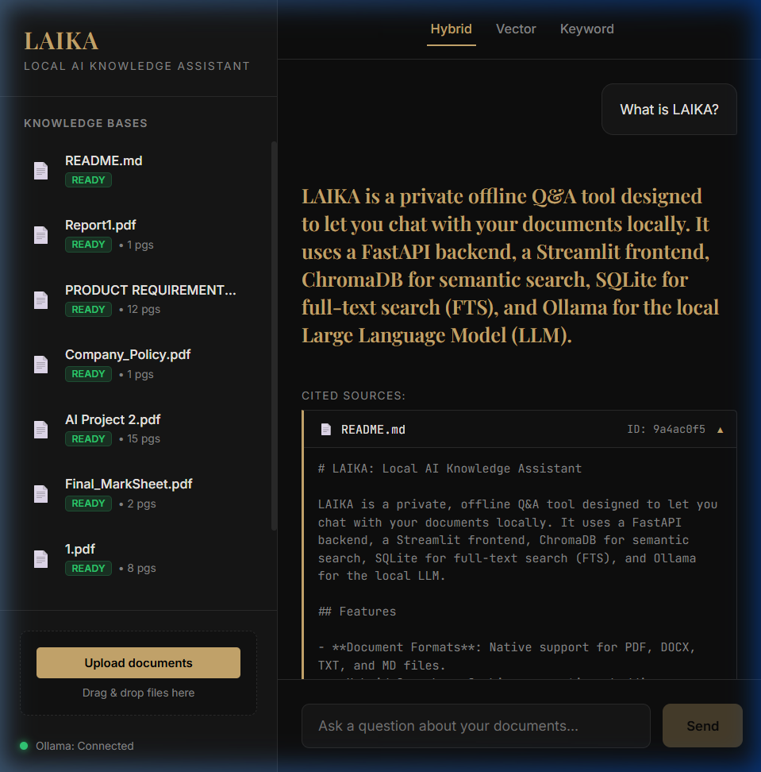
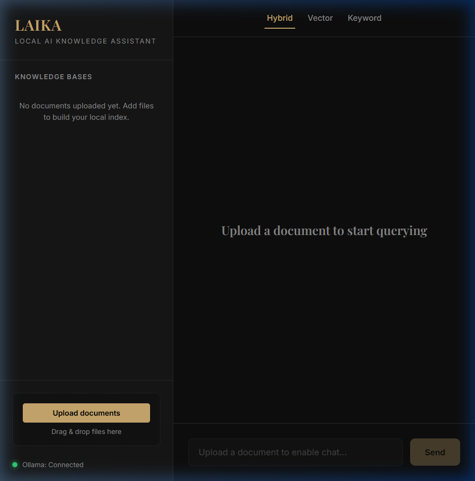

# LAIKA: Local AI Knowledge Assistant

LAIKA is a private, offline Q&A tool designed to let you chat with your documents locally. It features a FastAPI backend, a custom React + Vite frontend styled with a premium editorial dark aesthetic, ChromaDB for semantic vector search, SQLite for full-text keyword search (FTS), and Ollama for the local LLM.

---

## UI Screenshots

### Chat Interface and Streaming Citations


### Empty State (Upload Prompt)


---

## Features

- **Document Formats**: Native support for PDF, DOCX, TXT, and MD files.
- **Hybrid Search**: Combines semantic embeddings (ChromaDB) and keyword search (SQLite FTS5) using Reciprocal Rank Fusion (RRF). Toggle search modes between **Hybrid**, **Vector**, and **Keyword** dynamically in the UI.
- **Multi-turn Chat**: Tracks conversation history and automatically reformulates follow-up queries using the local LLM to preserve context.
- **Detailed Citations**: Interactive source cards displaying referenced text snippets and source files which expand/collapse on click.
- **Ollama Status Dot**: A visual status indicator (Green/Red) in the sidebar footer showing if the Ollama service is connected.

---

## Project Structure

```
laika/
├── app/                 # FastAPI backend endpoints and services
├── laika-ui/            # Custom React + Vite frontend
│   ├── src/
│   │   ├── api/         # Fetch API client and stream parser
│   │   ├── components/  # Sidebar, ChatArea, MessageBubble, SourceCard, DocItem, UploadZone
│   │   ├── hooks/       # useStream hook for ReadableStream state management
│   │   └── App.jsx      # Main state container and polling logic
│   └── vite.config.js   # Vite config with dev proxy configuration
├── screenshots/         # UI demonstration images
└── data/                # Local database storage (ignored in Git)
```

---

## Quick Start & Installation

### 1. Prerequisites
- **Python**: Version 3.12 or 3.13 installed.
- **Node.js & NPM**: Installed on your system for building/running the React UI.
- **Ollama**: Download and install [Ollama](https://ollama.com/). Pull the default model:
  ```bash
  ollama pull qwen2.5:3b
  ```
  Ensure Ollama is running in the background.

### 2. Set Up the Backend
Initialize the Python virtual environment and install backend dependencies:
```bash
# Navigate to the backend directory (if not already there)
cd laika

# Create virtual environment
python -m venv .venv

# Activate virtual environment
# Windows:
.venv\Scripts\activate
# macOS/Linux:
source .venv/bin/activate

# Install dependencies
pip install -r requirements.txt
```

### 3. Set Up the Frontend
Install Node packages for the React app:
```bash
# Navigate to the React frontend folder
cd laika-ui

# Install package dependencies
npm install
```

---

## Running the Application

To run the full stack, you need to start both the backend and frontend servers:

### 1. Start the Backend Server
In your first terminal (with the virtual environment activated, inside the `laika/` directory):
```bash
uvicorn app.main:app --port 8000 --reload
```
The FastAPI backend will start running on [http://localhost:8000](http://localhost:8000). You can check the Swagger documentation at `/docs`.

### 2. Start the Frontend Server
In your second terminal (inside the `laika/laika-ui/` directory):
```bash
npm run dev
```
Open [http://localhost:5173](http://localhost:5173) in your browser.

---

## How to Use LAIKA

1. **Upload Documents**: Use the "Upload documents" button or drag-and-drop `.pdf`, `.docx`, `.txt`, or `.md` files onto the sidebar.
2. **Track Indexing Status**: The sidebar shows an `Indexing...` status badge (pulsing gold) during document ingestion, which automatically updates to a green `Ready` badge once processing is complete.
3. **Configure Search Mode**: Toggle between **Hybrid**, **Vector**, and **Keyword** modes in the top bar to change the retrieval algorithm.
4. **Chat with Documents**: Ask questions in the chat input. The response will stream token-by-token with a blinking cursor.
5. **View Citations**: Click on any of the cited source cards under an LLM response to expand and read the exact text segment referenced.
